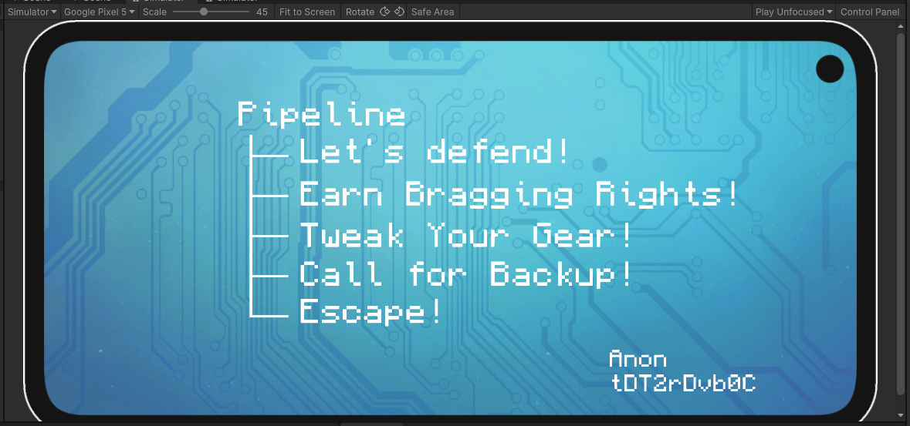
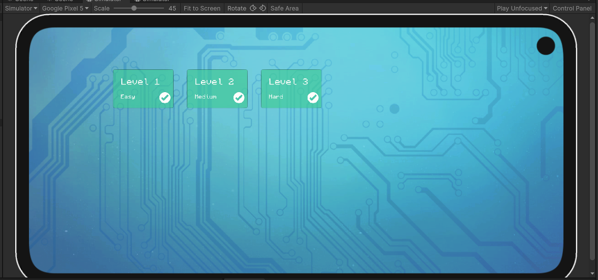
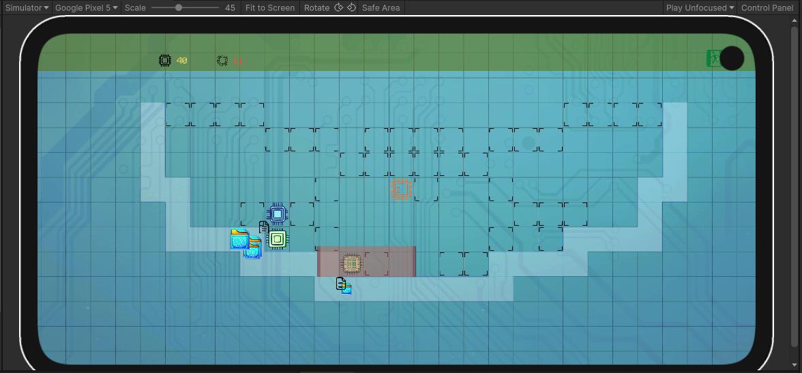

## Project Overview
This project is a Unity-based **Tower Defense** game. The game consists of multiple levels where players build defenses to prevent enemies from reaching the goal. It uses scripts for managing gameplay, levels, and in-game objects.

>LET'S DEFEND!!! ^\_\-

---

## Table of Contents

1. [Project Structure](./structure.md)
2. Configuration Files
    - [Levels Map Configuration](./configuration/level/levels.json.md)
    - [Level Configuration](./configuration/level/levelX.json.md)
    - [Google Services Configuration](./configuration/google-services.json.md)
3. [Scripts Overview](./code_specification/scripts_overview.md)
4. [How to Build](./build.md)
5. ~~Licensing~~
6. [Tested Environments](./tested_environments.md) (Table of tested enviroments)
7. [How to Extend](./extend_manual.md)

---
## Preview

[]
[]
[]

